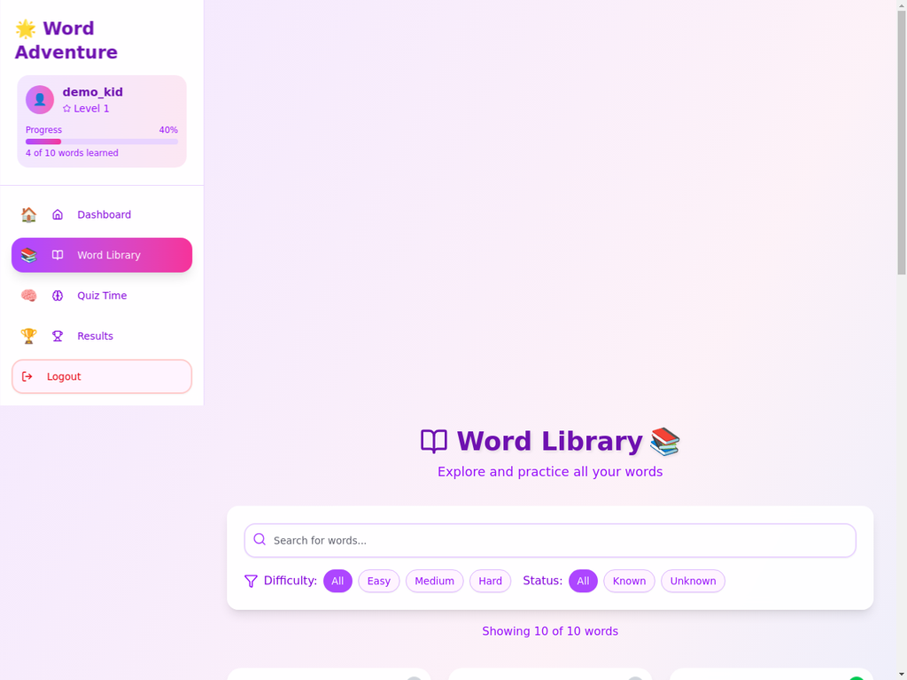

# 🌟 Word Adventure - Kids Learning Dashboard

A delightful and interactive vocabulary learning application designed specifically for children. This enhanced version features a modern React frontend with beautiful animations, kid-friendly design, and a Flask backend for data management.



## ✨ Features

### 🎯 Core Learning Features
- **Interactive Word Cards** - Visual learning with emoji and images
- **Speech Synthesis** - Hear word pronunciations with a click
- **Progress Tracking** - Monitor learning progress across difficulty levels
- **Quiz System** - Test knowledge with engaging quizzes
- **Difficulty Levels** - Easy, Medium, and Hard word categories

### 🎨 Enhanced UI/UX
- **Kid-Friendly Design** - Colorful, engaging interface designed for children
- **Smooth Animations** - Framer Motion animations for delightful interactions
- **Responsive Layout** - Works perfectly on desktop, tablet, and mobile
- **Dark/Light Themes** - Customizable appearance (coming soon)
- **Accessibility** - Screen reader friendly and keyboard navigation

### 📊 Progress & Analytics
- **Learning Statistics** - Track words learned, progress percentage, and streaks
- **Difficulty Breakdown** - See progress across different difficulty levels
- **Achievement System** - Unlock badges and rewards for milestones
- **Data Export/Import** - Backup and restore learning progress

### 👨‍👩‍👧‍👦 Parent Features
- **Settings Panel** - Customize learning experience
- **Progress Reports** - Monitor child's learning journey
- **Data Management** - Export/import learning data
- **Privacy First** - All data stored locally, no external tracking

## 🚀 New Enhanced Features (v2.3.0)

### 📱 Progressive Web App (PWA)
- **Installable App** - Can be installed on mobile devices and desktops
- **Offline Support** - Works without internet connection
- **Service Worker** - Caches essential content for offline use
- **App Manifest** - Complete PWA manifest with icons and shortcuts

### 🔄 API Integration & Sync
- **API Service Layer** - Comprehensive API service with Railway backend integration
- **Offline Sync** - Automatic synchronization when back online
- **Fallback Mode** - Graceful degradation to demo mode when API unavailable
- **Environment Configuration** - Easy API endpoint configuration

### ♿ Enhanced Accessibility
- **Accessibility Settings** - Comprehensive accessibility options panel
- **Font Size Adjustment** - Multiple font size options for better readability
- **High Contrast Mode** - Better visibility for users with visual impairments
- **Reduced Motion** - Option to minimize animations for sensitive users
- **Keyboard Navigation** - Full keyboard accessibility support
- **Screen Reader Support** - Enhanced ARIA labels and descriptions

### 🎮 Advanced Game Modes
- **Speed Challenge** - 60-second word recognition challenge
- **Survival Mode** - Continue learning until 3 mistakes
- **Precision Test** - Perfect accuracy challenge (10 words)
- **Memory Match** - Word-image matching game with timer
- **Word Rush** - Quick-fire identification game
- **Master Challenge** - Ultimate vocabulary test with limited lives

### 🐾 Virtual Pet System
- **Interactive Pet Care** - Feed and play with virtual learning buddy
- **Pet Customization** - Multiple pet types (cat, dog, rabbit, etc.)
- **Happiness System** - Pet responds to learning progress and care
- **Accessory Shop** - Earn XP to buy pet accessories and decorations
- **Growth System** - Pet grows and evolves with learning progress

### 📁 Enhanced Content Management
- **Bulk Word Import** - CSV file upload for adding multiple words at once
- **Category Management** - Create and manage custom word categories
- **Enhanced Word Library** - Improved search, filtering, and sorting
- **Progress Visualization** - Detailed learning progress charts and analytics

### 📊 Advanced Analytics Dashboard
- **Learning Insights** - Comprehensive progress tracking and insights
- **Performance Metrics** - Detailed accuracy and time tracking
- **Category Breakdown** - Progress visualization by word categories
- **Streak Tracking** - Daily learning streak monitoring
- **Achievement System** - Unlockable badges and milestones

## 🚀 Quick Start

### Prerequisites
- Node.js 18+ and pnpm
- Python 3.11+ and pip
- Modern web browser

### Frontend Setup
```bash
# Clone the repository
git clone <repository-url>
cd kid-friendly-dashboard-enhanced

# Install dependencies
pnpm install

# Start development server
pnpm run dev

# Build for production
pnpm run build
```

### Backend Setup (Optional)
```bash
# Navigate to backend directory
cd backend

# Install Python dependencies
pip install -r requirements.txt

# Run Flask server
python app.py
```

## 📁 Project Structure

```
kid-friendly-dashboard-enhanced/
├── src/
│   ├── components/          # React components
│   │   ├── ui/             # Reusable UI components
│   │   ├── Dashboard.jsx   # Main dashboard
│   │   ├── WordLibrary.jsx # Word browsing
│   │   ├── WordTesting.jsx # Quiz functionality
│   │   ├── Results.jsx     # Progress results
│   │   ├── LoginPage.jsx   # Authentication
│   │   ├── Layout.jsx      # App layout
│   │   └── ParentSettings.jsx # Settings panel
│   ├── hooks/              # Custom React hooks
│   ├── lib/                # Utility functions
│   ├── assets/             # Static assets
│   ├── App.jsx             # Main app component
│   ├── App.css             # Global styles
│   └── main.jsx            # Entry point
├── backend/                # Flask backend (optional)
│   ├── app.py             # Main Flask application
│   ├── models/            # Database models
│   ├── routes/            # API routes
│   └── requirements.txt   # Python dependencies
├── docs/                  # Documentation
├── public/                # Public assets
├── package.json           # Node.js dependencies
├── vite.config.js         # Vite configuration
└── README.md              # This file
```

## 🎮 How to Use

### For Kids
1. **Login** - Enter your name and a secret word
2. **Dashboard** - See your progress and current word
3. **Word Library** - Browse and practice all words
4. **Quiz Time** - Test your knowledge with fun quizzes
5. **Results** - Check your scores and achievements

### For Parents
1. **Settings** - Customize the learning experience
2. **Progress Tracking** - Monitor your child's learning
3. **Data Management** - Export/import learning data
4. **Safety Features** - All data stays on your device

## 🛠️ Technology Stack

### Frontend
- **React 18** - Modern React with hooks and context
- **Vite** - Fast build tool and development server
- **Tailwind CSS** - Utility-first CSS framework
- **Framer Motion** - Smooth animations and transitions
- **Lucide Icons** - Beautiful, consistent icons
- **shadcn/ui** - High-quality UI components

### Backend (Optional)
- **Flask** - Lightweight Python web framework
- **SQLAlchemy** - Database ORM
- **Flask-JWT-Extended** - JWT authentication
- **Flask-CORS** - Cross-origin resource sharing

## 🎨 Design Philosophy

### Kid-Friendly Principles
- **Visual Learning** - Heavy use of emojis, colors, and images
- **Immediate Feedback** - Instant responses to user actions
- **Gamification** - Progress bars, achievements, and rewards
- **Safety First** - No external data collection or tracking
- **Accessibility** - Screen reader support and keyboard navigation

### Technical Principles
- **Performance** - Optimized for fast loading and smooth interactions
- **Responsive** - Works on all device sizes
- **Offline-First** - Core functionality works without internet
- **Progressive Enhancement** - Graceful degradation for older browsers

## 📱 Browser Support

- Chrome 90+
- Firefox 88+
- Safari 14+
- Edge 90+

## 🔒 Privacy & Security

- **Local Storage** - All data stored on user's device
- **No Tracking** - No analytics or external data collection
- **Child Safety** - Designed with COPPA compliance in mind
- **Offline Capable** - Works without internet connection

## 🤝 Contributing

We welcome contributions! Please see our [Contributing Guide](./CONTRIBUTING.md) for details.

### Development Setup
1. Fork the repository
2. Create a feature branch
3. Make your changes
4. Add tests if applicable
5. Submit a pull request

## 📄 License

This project is licensed under the MIT License - see the [LICENSE](./LICENSE) file for details.

## 🙏 Acknowledgments

- **Original Project** - Built upon the initial Kid-Friendly Dashboard concept
- **Design Inspiration** - Modern educational apps and child psychology research
- **Open Source Libraries** - Thanks to all the amazing open source contributors

## 📞 Support

- **Issues** - Report bugs on GitHub Issues
- **Discussions** - Join our GitHub Discussions
- **Email** - Contact us at support@wordadventure.com

## 🗺️ Roadmap

### Version 2.0 (Coming Soon)
- [ ] Multiplayer mode for siblings
- [ ] Custom word lists
- [ ] Voice recording for pronunciation practice
- [ ] Offline mobile app
- [ ] Teacher dashboard for classrooms

### Version 2.1
- [ ] Multiple language support
- [ ] Advanced analytics
- [ ] Parental controls
- [ ] Cloud sync (optional)

---

Made with ❤️ for kids who love to learn! 🌟

